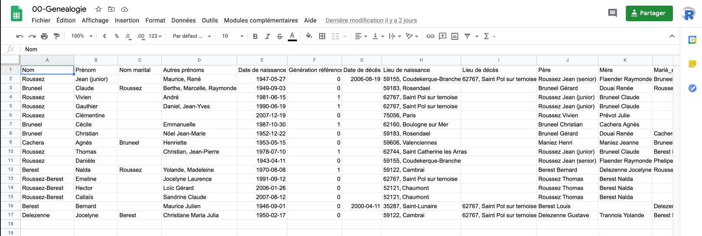

# Présentation

Né pendant le premier confinement dû à l'épidémie de Covid19 en mars 2020, ce projet avait vocation à :

- Digitaliser la mémoire des anciens
- Centraliser l'accès aux photos, souvenirs... Pour que toute la famille puisse y accéder
- S'occuper en famille pendant le confinement ;)

Partant des famille Roussez et Bruneel, qui vivra où le projet s'arrêtera !

# Mise en oeuvre 

Tout part d'un tableur en ligne accessible par tous les membres de la famille et présenté comme suit :

Le but du jeu étant que tou(te)s collaborent et remplissement pour la partie de la la/le concerne. Dans le même dossier en ligne que ce classeur se trouvent également des fichiers documents et image qui permettent de stocker des informations moins structurées et plus qualitatives (photos, textes) sur tous les membres de la famille poru établir les portraits qui figurent dans ce site.

